# FairPlay Review

A human-in-the-loop chess fair-play system built as a **selective-prediction** problem. The model does not ban players. It converts move evidence into calibrated account risk, ranks the highest-risk accounts, and fills a fixed-capacity reviewer queue.

The repository runs immediately on deterministic, anonymized synthetic evidence (`make demo`), and runs end-to-end on real Lichess data with `make real`: a streamed dump slice, public `tosViolation` proxy labels, and Stockfish move evidence feeding the same model, API, and UI.

## What is implemented

- Streaming `.pgn.zst` ingestion without expanding monthly dumps.
- Node-limited Stockfish multi-PV analysis with engine/version-ready provenance.
- Move features: top-1/top-3 match, centipawn loss, position complexity, clock use, streaks, and performance delta.
- Account-window aggregation and gradient-boosted classification.
- Held-out sigmoid calibration and top-K reviewer-budget policy.
- Metrics appropriate to rare events: PR-AUC, Brier score, ECE, and recall at fixed FPR.
- FastAPI service with persistent SQLite review decisions.
- Responsive React/TypeScript review console with evidence timelines.
- Replayable legal chess positions with SAN/UCI moves, square highlighting, move navigation, and a vertical evaluation bar.
- Tests and an asynchronous API load-test harness.

## Architecture

```mermaid
flowchart LR
    A[Lichess PGN zst] --> B[Streaming parser]
    B --> C[Stockfish worker]
    C --> D[Move evidence / Parquet]
    D --> E[Account-window features]
    E --> F[Boosted model]
    F --> G[Probability calibration]
    G --> H[Top-K policy]
    H --> I[Reviewer API + queue]
    I --> J[Human decision]
    J --> K[Monitoring / future labels]
```



Engine analysis is asynchronous and expensive; score serving over precomputed account features is cheap. Benchmarks should report those two latency classes separately.

## Quick start

Requires Python 3.11+ and Node 20+.

```bash
make install
make demo
```

Run the API and UI in separate terminals:

```bash
make api
make ui
```

Open [http://127.0.0.1:5173](http://127.0.0.1:5173). API documentation is at [http://127.0.0.1:8000/docs](http://127.0.0.1:8000/docs).

Tests and production UI build:

```bash
make test
make build
```

## Real-data path

The real pipeline runs end-to-end with one command (requires Stockfish, e.g. `brew install stockfish`):

```bash
make real
```

It performs, with per-stage caching under `data/processed/real/`:

1. Streams a configurable slice (default 150 MB) of a monthly [Lichess open database](https://database.lichess.org/) dump via an HTTP range request — no 30 GB download.
2. Scans player activity from raw PGN headers (bullet games and BOT accounts excluded).
3. Fetches public `tosViolation` flags through the bulk-user API (≤300 IDs/request, paced) until it has enough proxy positives.
4. Builds a cohort of proxy positives plus rating/speed/activity-matched unlabeled controls; closed-but-unmarked accounts are excluded as ambiguous.
5. Runs node-limited multi-PV Stockfish over the cohort's real games in parallel workers.
6. Trains and calibrates the boosted model on real features, ranks the top-K, and writes `artifacts/` for the same API and UI (`data_mode: real_lichess_tos_proxy`).

Account IDs are hashed in every artifact; the username map stays in git-ignored `data/processed/real/id_map_private.json`. See `fairplay real --help` for knobs (`--month`, `--slice-mb`, `--target-positives`, `--nodes`, ...). `make demo` still regenerates the synthetic benchmark, overwriting the same artifacts.

The dump notes that only a subset contains evaluations, while clock comments are available from April 2017 onward. Lower-level building blocks remain available. Stream a dump into inspectable game metadata:

```bash
.venv/bin/fairplay ingest data/raw/lichess_db_standard_rated_YYYY-MM.pgn.zst \
  data/processed/games.jsonl --max-games 100000
```

Install Stockfish separately, export a player's public games as PGN, and extract move evidence:

```bash
STOCKFISH_PATH=/path/to/stockfish .venv/bin/fairplay analyze data/raw/player.pgn \
  data/processed/player_moves.parquet --username PLAYER --max-games 20
```

The analyzer deliberately skips early opening plies and forced moves, uses a fixed node budget, evaluates the played move when it falls outside multi-PV, and derives think time from clock differences plus increment.

The public bulk-user API accepts up to 300 IDs and explicitly asks clients not to attempt a full user export. Treat `tosViolation` as a noisy **terms-of-service proxy**, not a game-level engine-cheating label. Cache responses, record collection timestamps, observe official quotas, and never publish a list of flagged usernames. See the [official endpoint specification](https://github.com/lichess-org/api/blob/master/doc/specs/tags/users/api-users.yaml) and [`tosViolation` schema](https://github.com/lichess-org/api/blob/master/doc/specs/schemas/User.yaml).

## Evaluation contract

1. Split by account; no account may appear in multiple splits.
2. Keep a final temporal holdout from a later month.
3. Match proxy positives and unlabeled controls by rating, speed, account age, and activity.
4. Report recall at FPR `1e-2`, `1e-3`, and—only with enough negatives—`1e-4`, with account-bootstrap confidence intervals.
5. Report precision@K / reviewer yield for fixed daily capacities.
6. Report calibration under assumed deployment prevalences; do not infer real precision from a balanced test set.
7. Plot detection recall against synthetic assistance rates (20%, 50%, 100%).

At prevalence `π`, deployment precision is:

```text
precision = TPR × π / (TPR × π + FPR × (1 − π))
```

This is why a superficially small false-positive rate can still overwhelm reviewers.

## Safety and scope

- Synthetic injection is performed offline on evidence traces. Never use an engine during a live human game; that violates [Lichess Fair Play](https://lichess.org/page/fair-play).
- Real unmarked accounts are **unlabeled**, not verified clean.
- A terms-of-service mark can represent more than engine assistance.
- Public demo artifacts must use hashed IDs and synthetic or consented data.
- The UI calls every item a “case,” not a “cheater,” and exposes no auto-enforcement endpoint.

## Baselines

Start with heuristic thresholds and the calibrated boosting model. Add a temporal CNN/Transformer only after the account split is leak-free. [Kaladin](https://github.com/lichess-org/kaladin) is a useful open-source CNN/reference architecture, while [Irwin](https://github.com/clarkerubber/irwin) is a legacy public implementation based on multi-PV evidence. Their internal data and integration assumptions make them references—not automatically reproducible apples-to-apples benchmarks.

See [docs/MODEL_CARD.md](docs/MODEL_CARD.md) for intended use and failure modes, and [warehouse/bigquery_schema.sql](warehouse/bigquery_schema.sql) for the analytical warehouse layer.
